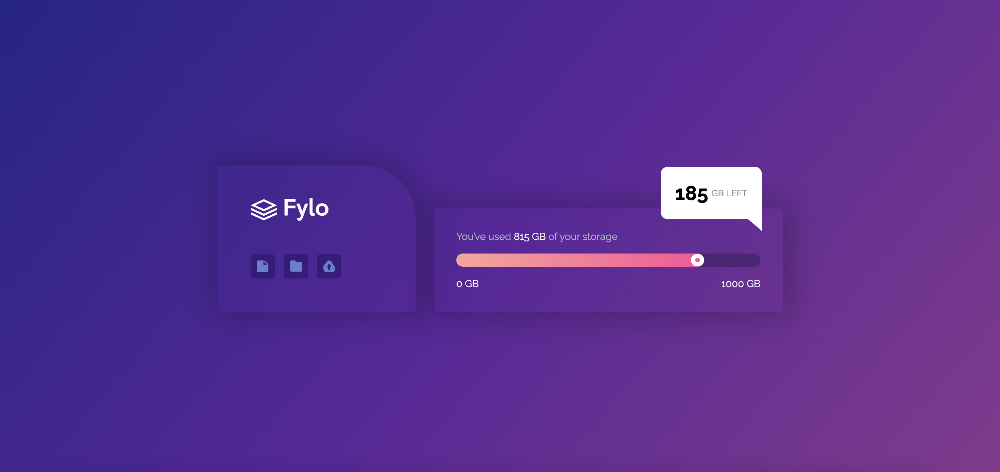
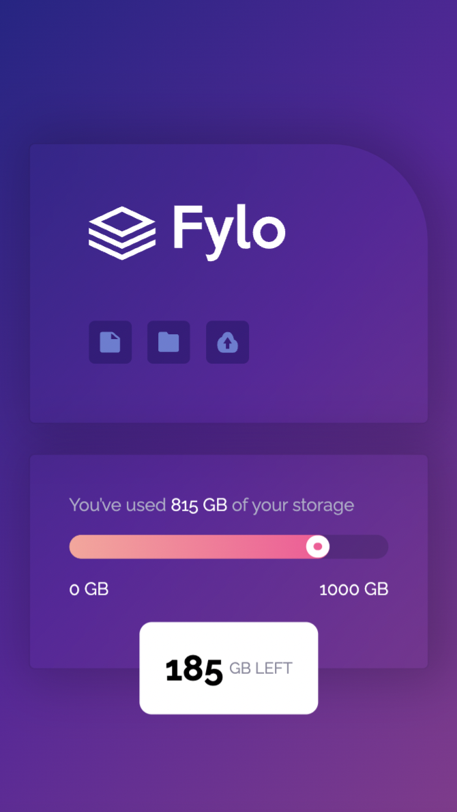

# Frontend Mentor - Fylo data storage component solution

This is a solution to the [Fylo data storage component challenge on Frontend Mentor](https://www.frontendmentor.io/challenges/fylo-data-storage-component-1dZPRbV5n). Frontend Mentor challenges help you improve your coding skills by building realistic projects. 

## Table of contents

- [Overview](#overview)
  - [The challenge](#the-challenge)
  - [Screenshot](#screenshot)
  - [Links](#links)
- [My process](#my-process)
  - [Built with](#built-with)
  - [What I learned](#what-i-learned)
  - [Continued development](#continued-development)
- [Author](#author)

## Overview

### The challenge

Users should be able to:

- View the optimal layout for the site depending on their device's screen size

### Screenshot

### Links

- Solution URL: [Github](https://github.com/doleetos/data-storage)
- Live Site URL: [Live Site](https://doleetos.github.io/data-storage/)

## My process

### Built with

- Semantic HTML5 markup
- CSS custom properties
- Flexbox
- Mobile-first workflow

### What I learned

This project really helped ground my knowledge of using positions and the content property of CSS. 

### Continued development

I am currently learning ReactJS and want to re-build this project in the near future using ReactJS.

## Author

- Website - [Githut](https://github.com/doleetos)
- Frontend Mentor - [@doleetos](https://www.frontendmentor.io/profile/doleetos)

